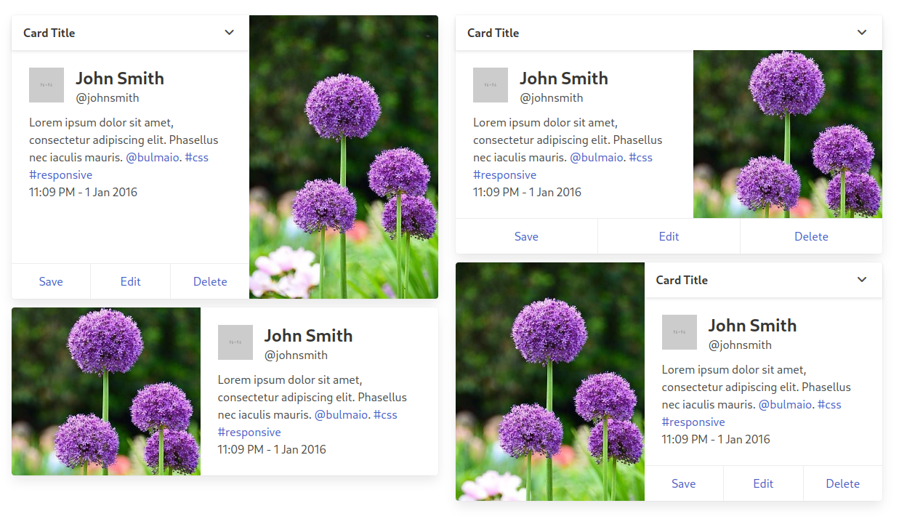

<h1>bulma-horizontal-card</h1>

 
 

A [Bulma CSS](https://github.com/jgthms/bulma) extension to support horizontal cards. Since the maintainers don't seem interested in implementing them right now.

Built for the latest version of Bulma (0.9.4)! You'll need it in order for this code to work.

**Documentation, installation instructions, and demonstrations can be found here: https://dev.gimon.zone/bulma-horizontal-card/~site**.

## important notice!
This extension makes use of the [CSS pseudo-class `:has()`](https://developer.mozilla.org/en-US/docs/Web/CSS/:has) in order to achieve automatic/contextual control of the `.card-image`'s `border-radius`. Specifically, it is used in a single case to control the removal of the bottom `border-radius` from the `.card-image` when a `footer.card-footer` element is present as a child of `.card`. This was the best way I could think to implement this.

`:has()` is supported in Chrome, Edge, Opera, and Safari by default, and major mobile browers, but [not in Firefox without enabling a special flag](https://caniuse.com/css-has) (as of writing). It is NOT supported in any version of Internet Explorer.

So, this extension includes additional utility classes that can force changes in the `border-radius` that the use of `:has()` otherwise would have. Just manually add them to your `.card-image` element. See the documentation for details.

## to do
- [ ] Add classes for defining `.card-image` width
- [ ] Add utility radius classes
- [ ] Fine-tune responsiveness of horizontal cards
- [ ] Improve responsiveness of the sticky inline-footer

## contributing
Contributions to this extension are always welcome!

Though this project officially lives at [dev.gimon.zone](https://dev.gimon.zone/bulma-horizontal-card/~files), there is a [mirror on Github](https://github.com/telophase/bulma-horizontal-card) that accepts contributions. 

Fork this project on Github and file a pull request, and I'll merge it back into main. :)

## license
&#169; [Alex H.](https://gimon.zone) 2023-present. 
MIT License.

Initial code and CSS class syntax based on the work/input of contributors in [this Bulma pull request](https://github.com/jgthms/bulma/pull/1596). Thank you!

